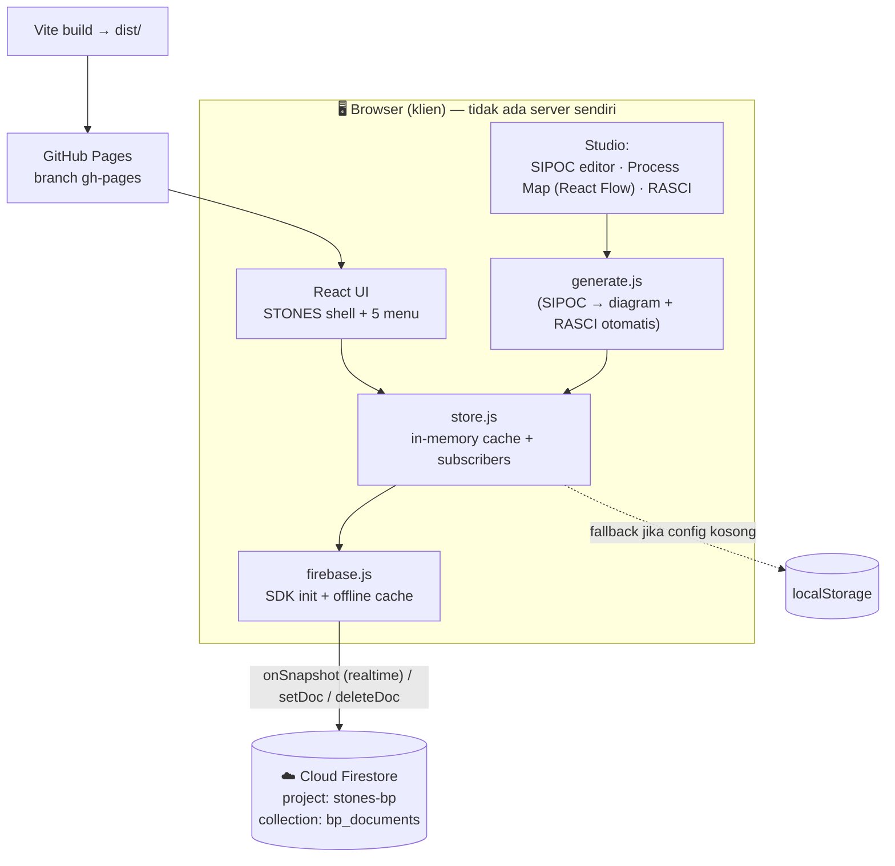

# STONES — Arsitektur & Dokumentasi

**STONES** (Business Process Suite) — aplikasi untuk **mengembangkan** dan **menyimpan**
dokumen Business Process (BP), lengkap dengan approval workflow, versioning, dan komentar.
Backend memakai **Cloud Firestore** (Firebase), frontend **React** yang di-host di **GitHub Pages**.

- **Live:** https://dhanyindraswara.github.io/bp_msbp/
- **Repo:** https://github.com/dhanyindraswara/bp_msbp
- **Firebase project:** `stones-bp`

---

## 1. Gambaran Arsitektur



**Model:** *serverless / client-only*. Tidak ada backend server yang kamu kelola. Browser
bicara **langsung** ke Firestore lewat Firebase SDK; keamanan diatur oleh **Firestore
Security Rules**, bukan oleh server. Hosting cuma menyajikan file statis (HTML/JS/CSS).

Diagram versi teks:

```
[ React App di browser ]
   │  (baca sinkron dari cache, tulis lewat store)
   ▼
[ store.js ]  ──setDoc/onSnapshot──►  [ Cloud Firestore: bp_documents ]
   │
   └── fallback ──►  [ localStorage ]   (kalau Firebase config kosong / offline)

[ Vite build ] ──► [ dist/ ] ──► [ GitHub Pages (gh-pages) ] ──► pengguna
```

---

## 2. Tech Stack

| Lapisan | Teknologi |
|---|---|
| UI | **React 18** + **Vite** |
| Diagram | **React Flow v11** (`reactflow`) |
| Styling | **Tailwind CSS** + CSS komponen custom |
| Import/Export Excel | **SheetJS** (`xlsx`) |
| Export PNG | **html-to-image** |
| Backend / Database | **Cloud Firestore** (`firebase` v12) |
| Persistensi offline | Firestore IndexedDB cache (multi-tab) |
| Hosting | **GitHub Pages** (branch `gh-pages`, base `/bp_msbp/`) |
| Fallback | `localStorage` (kalau tanpa Firebase) |

---

## 3. Struktur Kode

```
src/
  main.jsx                 entry React
  App.jsx                  STONES shell: sidebar 5 menu, boot store, loading gate
  index.css                Tailwind + semua style komponen
  lib/
    firebaseConfig.js      config Firebase (apiKey dst.) — publik, aman di repo
    firebase.js            init Firebase App + Firestore (offline cache)
    store.js               ★ data layer backend-agnostic (Firestore / localStorage)
    generate.js            SIPOC → processes/actors/flows/edges/positions
    sample.js              data contoh + project kosong
    constants.js           palet warna, ukuran, opsi RASCI, storage key
  components/
    SipocEditor.jsx        editor tabel SIPOC + PPI + import xlsx/csv
    ProcessMap.jsx         React Flow + title-block ITM + legend + export PNG
    Rasci.jsx              matriks RASCI + auto-rules + export CSV/XLSX
    nodes.jsx              node React Flow (box / process / band)
  menus/
    DocumentDevelopment.jsx  studio + workflow + versi + komentar (drawer)
    DocumentActionRequest.jsx antrian review (approve/reject) + New BP
    Repository.jsx          daftar semua BP (open/duplicate/delete)
    GlobalSearch.jsx        pencarian lintas dokumen
    Dashboard.jsx           reporting (hitungan live + placeholder chart)
```

**`store.js` adalah inti.** Semua menu baca/tulis lewat sini, jadi ganti backend
(localStorage ↔ Firestore) tidak menyentuh komponen UI.

---

## 4. Data Model (Firestore)

**Collection utama:** `bp_documents/{BP-000x}` — 1 dokumen = 1 Business Process.

```jsonc
bp_documents/BP-0001 = {
  id: "BP-0001",
  name: "HSE Marine & Logistic",     // diambil dari header.processName
  version: "1.0",                    // header.version
  status: "draft" | "in_review" | "approved" | "published",
  project: {                         // ← isi dokumen (yang diedit)
    header:   { processName, processOwner, version },
    template: { logo, level, title, bpNo, effectiveDate, revision,
                preparedBy, reviewedBy, approvedBy },
    sipoc:    [ { id, supplier, input, process, output, customer } ],
    ppi:      [ { id, process, indicator } ],
    flows:    [ { n, text } ],
    positions:{ "P:...": {x,y}, "A:...": {x,y} },   // posisi node di map
    rasciOverrides: { "proc||actor": "A/R" },
    flowLabelMode: "number" | "text",
    highlight: "..."
  },
  versions: [ { id, snapNo, bpVersion, note, data(snapshot project), author, createdAt } ],
  comments: [ { id, author, body, resolved, createdAt } ],   // riwayat chat/diskusi
  audit:    [ { id, ts, actor, action, detail } ],           // jejak audit
  createdAt, updatedAt
}

app/meta = { seq: 12 }   // counter untuk ID BP-000x
```

**Data per-browser (localStorage, bukan Firestore):**
- `stones-openid` — dokumen mana yang sedang kamu buka (state UI, per device).
- `stones-user` — nama user aktif (dipakai untuk author komentar/audit).

> **Catatan skalabilitas:** saat ini `versions`, `comments`, `audit` disimpan sebagai
> **array di dalam dokumen**. Firestore membatasi **1 dokumen = maks 1 MB**. Kalau
> chat/versi makin banyak, rencananya dipindah ke **subcollection**
> (`bp_documents/{id}/comments`, `/versions`, `/audit`) + `files` untuk PDF/PNG.

---

## 5. Cara Kerja Data (read / write / realtime)

1. **Boot** — `App` memanggil `initStore()`. Kalau ada config Firebase → subscribe
   `onSnapshot(collection('bp_documents'))`; kalau tidak → load `localStorage`.
2. **Cache in-memory** — semua dokumen ditaruh di memori. **Baca** (getDoc/listDocs)
   bersifat **sinkron** dari cache → UI cepat, tak perlu await di komponen.
3. **Tulis** — fungsi seperti `saveDoc`, `saveVersion`, `approveDoc`, `addComment`:
   update cache → `setDoc()` ke Firestore → `emit()` agar React re-render.
4. **Realtime** — perubahan dari device lain masuk via `onSnapshot` → cache diperbarui
   → semua menu ikut ter-update otomatis (tanpa refresh).
5. **Autosave** — editan di studio disimpan otomatis (debounce ~700 ms) ke Firestore.
6. **Offline** — Firestore cache IndexedDB menyimpan data lokal; saat online kembali,
   perubahan otomatis tersinkron.

---

## 6. Modul / Menu

| Menu | Fungsi |
|---|---|
| **Document Action Request** | Antrian review; Approve/Reject dokumen `In Review`; tombol **+ New BP** |
| **Document Development** | Studio inti: SIPOC → Process Map (template ITM) + RASCI; workflow, versi, komentar |
| **Repository** | Daftar semua BP (ID, nama, versi, status, update) — open/duplicate/delete |
| **Global Search** | Cari lintas semua dokumen (nama, SIPOC, aktor, flow, PPI, komentar) |
| **Dashboard** | Reporting (hitungan status live; chart menyusul) |

**Document control (Fase 1):** status lifecycle **Draft → In Review → Approved →
Published**, version snapshot + restore, audit trail, dan komentar per dokumen.

---

## 7. Build & Deploy

```bash
npm install       # pasang dependency
npm run dev       # dev server (http://localhost:5173/bp_msbp/)
npm run build     # build produksi → dist/
```

Deploy: `dist/` di-push ke branch **`gh-pages`**; GitHub Pages menyajikannya di
`/bp_msbp/`. (Vite `base: '/bp_msbp/'` supaya path aset benar di subfolder.)

---

## 8. 💳 Cara Kerja Billing Firebase

### Plan: **Blaze (pay-as-you-go)** dengan target **$0**
Kita pakai Blaze karena **Cloud Storage wajib Blaze** sejak **3 Feb 2026**. Tapi Blaze
punya **kuota gratis ("no-cost / Always Free")** — **selama pemakaian di bawah kuota,
tagihan tetap $0.** Kamu hanya bayar kalau **melebihi** kuota.

### Kuota gratis yang relevan

**Cloud Firestore (reset harian):**
| Metrik | Kuota gratis |
|---|---|
| Data tersimpan | **1 GiB** total |
| **Reads** (baca dokumen) | **50.000 / hari** |
| **Writes** (tulis dokumen) | **20.000 / hari** |
| **Deletes** | **20.000 / hari** |
| Egress jaringan | 10 GiB / bulan |

**Cloud Storage (kalau nanti dipakai untuk PDF/PNG):**
| Metrik | Kuota gratis |
|---|---|
| Penyimpanan | **5 GB** |
| Download / egress | **1 GB / hari** |
| Operasi upload | **20.000 / hari** |
| Operasi download | **50.000 / hari** |

*(Angka bisa berubah — sumber resmi: https://firebase.google.com/pricing)*

### Apa yang "menghabiskan kuota" di STONES
- **Buka aplikasi** → listener realtime membaca dokumen di collection = **reads**.
  (mis. 80 dokumen × 40 sesi/hari ≈ 3.200 reads — jauh di bawah 50.000.)
- **Autosave saat ngedit** → **writes** (di-debounce ~700 ms; 1 write per jeda edit).
- **Approve / komentar / save version** → masing-masing 1 write.
- **Hapus dokumen** → 1 delete.

Untuk **tool internal** (puluhan user, ratusan dokumen) ini **sangat aman** di kuota gratis.

### Kapan mulai kena biaya (kalau lewat kuota)
Perkiraan harga Blaze (bervariasi per region):
- Firestore: ~**$0,06 / 100 rb reads**, ~**$0,18 / 100 rb writes**, ~**$0,02 / 100 rb deletes**,
  ~**$0,18 / GiB-bulan** penyimpanan.
- Storage: ~**$0,026 / GB-bulan** simpan, ~**$0,12 / GB** download.

Artinya walau lewat sedikit, biayanya **receh** (sen-senan) — bukan tiba-tiba jutaan.

### Cara menjaga tetap $0 & aman
1. **Budget alert** di *Google Cloud → Billing → Budgets & alerts* (mis. Rp 20.000,
   alert 50/90/100%). ⚠️ Ini **notifikasi**, bukan pemutus otomatis.
2. **Pantau pemakaian**: *Firebase Console → ⚙️ Usage and billing* — lihat reads/writes
   vs kuota gratis.
3. **Hard-stop (opsional, lanjutan)**: bikin Cloud Function yang menonaktifkan billing
   saat budget tercapai (butuh setup tambahan). Untuk sekarang, kuota gratis + alert
   sudah cukup.
4. **Hindari boros reads**: nanti kalau dokumen ribuan, ganti listener "seluruh
   collection" jadi **query berbatas / pagination** dan **subcollection** untuk chat.

### Ringkas
> Blaze = "kartu terpasang, tapi bayar hanya kalau lewat kuota gratis." Untuk skala
> STONES sekarang, praktis **$0/bulan**. Kartu hanya jaring pengaman kalau pemakaian
> melonjak — dan itu pun harganya bertahap/kecil, plus ada budget alert.

---

## 9. Keamanan (status & rencana)

**Sekarang:** Firestore **test mode** (Rules terbuka, expired ~30 hari). Cukup untuk
konek & uji coba, **tapi belum aman** — siapa pun yang tahu URL bisa baca/tulis.

**Rencana berikutnya (sangat disarankan):**
1. **Firebase Auth (login Google)** — batasi akses ke domain/akun perusahaan.
2. **Security Rules** — `allow read, write: if request.auth != null` (atau berdasarkan
   role/email), plus `authorized domains` untuk `github.io`.
3. **Storage Rules** serupa saat fitur upload aktif.

---

## 10. Roadmap

- [x] Studio SIPOC → Process Map (template ITM) + RASCI, export PNG/JSON/CSV/XLSX
- [x] Multi-dokumen + Repository + Global Search
- [x] Document control Fase 1: versi + audit + approval workflow + komentar
- [x] Backend Cloud Firestore (realtime, offline cache)
- [ ] **Firebase Auth + Security Rules** (kunci akses)
- [ ] **Cloud Storage**: upload PDF/PNG (file di Storage, URL di Firestore, subcollection `files/`)
- [ ] Pindah `comments`/`versions`/`audit` ke **subcollection** (skalabilitas)
- [ ] SOP Builder, Forms Library, Dashboard reporting lanjutan
```
