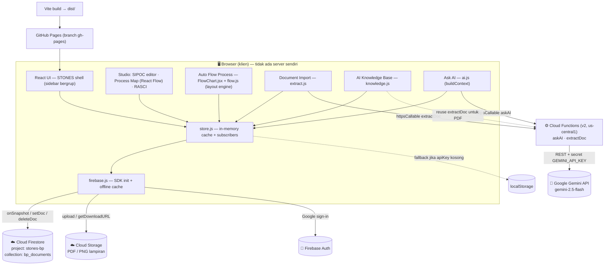

# STONES — Arsitektur & Dokumentasi Developer

**STONES** (Business Process Suite) — aplikasi untuk **mengembangkan, mengelola, dan
menyimpan** dokumen Business Process (BP), SOP, dan dokumen perusahaan. Termasuk approval
workflow, versioning, komentar, import PDF, generator flowchart SOP, dan asisten AI yang bisa
membaca knowledge base internal.

- **Live:** https://dhanyindraswara.github.io/bp_msbp/
- **Repo:** https://github.com/dhanyindraswara/bp_msbp
- **Firebase project:** `stones-bp` (Blaze plan, target biaya ~$0)

> Dokumen ini untuk **developer**. Untuk panduan pemakaian aplikasi, lihat
> [`USER_GUIDE.md`](./USER_GUIDE.md).

---

## 1. Gambaran Arsitektur

Model: **serverless / client-first**. Tidak ada backend server yang dikelola sendiri.
Browser bicara **langsung** ke Firestore/Storage/Auth lewat Firebase SDK. Satu-satunya kode
sisi-server adalah **Cloud Functions** yang berfungsi sebagai **proxy aman ke Google Gemini**
(supaya API key AI tidak pernah ada di browser).



Keamanan diatur oleh **Firebase Auth** (login wajib) + **Firestore/Storage Security Rules**
(`request.auth != null`), bukan oleh server. Hosting hanya menyajikan file statis.

---

## 2. Tech Stack

| Lapisan | Teknologi |
|---|---|
| UI | **React 18** + **Vite** (base path `/bp_msbp/`) |
| Diagram BP map | **React Flow v11** (`reactflow`) |
| Flowchart SOP | Renderer HTML/SVG custom (`FlowChart.jsx`) + layout engine (`flow.js`) |
| Styling | **Tailwind CSS** + CSS komponen custom (`index.css`) |
| Import/Export Excel | **SheetJS** (`xlsx@0.18.5`) |
| Export PNG | **html-to-image** |
| Auth | **Firebase Auth** (Google sign-in) |
| Database | **Cloud Firestore** (`firebase` v12) — realtime, offline IndexedDB cache |
| File storage | **Cloud Storage** (PDF/PNG) |
| AI | **Cloud Functions v2** (proxy) → **Google Gemini** (`gemini-2.5-flash`) |
| Hosting web | **GitHub Pages** (branch `gh-pages`) |
| Fallback | `localStorage` (kalau `apiKey` kosong / mode lokal) |

---

## 3. Struktur Kode

```
functions/
  index.js                 Cloud Functions: askAI (Gemini proxy) + extractDoc (PDF→JSON)

src/
  main.jsx                 entry React
  App.jsx                  STONES shell: sidebar bergrup (NAV), auth gate, boot store, routing
  index.css                Tailwind + semua style komponen
  lib/
    firebaseConfig.js      config Firebase (apiKey dst.) — publik, aman di repo
    firebase.js            init App + Firestore(offline cache) + Auth + Storage + Functions
    auth.js                Google sign-in (watchAuth / signInGoogle / signOutUser)
    store.js               ★ data layer backend-agnostic (Firestore / localStorage)
    generate.js            SIPOC → processes/actors/flows/edges/positions (derivation engine)
    sample.js              data contoh + blankProject()
    constants.js           palet warna, ukuran, opsi RASCI
    files.js               upload/hapus file ke Cloud Storage (subcollection files/)
    extract.js             client extractDoc (PDF → draft SOP terstruktur)
    ai.js                  Ask AI: buildContext() dari semua BP + knowledge, panggil askAI
    flow.js                Auto Flow Process: model + layout engine (node + konektor)
    knowledge.js           AI Knowledge Base: CRUD referensi + buildKnowledgeContext()
  components/
    SipocEditor.jsx        editor tabel SIPOC + PPI + import xlsx/csv
    ProcessMap.jsx         React Flow + title-block ITM + legend + export PNG
    Rasci.jsx              matriks RASCI + auto-rules + export CSV/XLSX
    nodes.jsx              node React Flow (box / process / band)
    FlowChart.jsx          renderer swimlane flowchart SOP + drag/rename + export PNG
  menus/
    DocumentActionRequest.jsx  antrian review (approve/reject) + New BP
    DocumentDevelopment.jsx    studio inti + workflow + versi + komentar (drawer)
    DocumentImport.jsx         upload PDF → extractDoc → review → simpan (docType SOP)
    AutoFlow.jsx               form lane+langkah → FlowChart (docType FLOW)
    Repository.jsx             daftar semua BP (open/duplicate/delete)
    GlobalSearch.jsx           pencarian lintas dokumen
    AskAI.jsx                  chat AI (Gemini)
    KnowledgeBase.jsx          upload/paste referensi (docType KNOWLEDGE)
    Dashboard.jsx              reporting (hitungan live + placeholder chart)
```

**`store.js` adalah inti data.** Semua menu baca/tulis lewat sini, jadi mengganti backend
(localStorage ↔ Firestore) tidak menyentuh komponen UI. Baca bersifat **sinkron** dari cache.

---

## 4. Menu (sidebar bergrup — `App.jsx`, array `NAV`)

Sidebar dikelompokkan; `NAV` menerima item standalone `{ id, label, d }` maupun section
`{ group, items }`.

| Grup | Menu (`id`) | Fungsi |
|---|---|---|
| — | **Dashboard** (`dashboard`) | Reporting (hitungan status live; chart menyusul) |
| **Business Process** | **Document Development** (`develop`) | Studio inti: SIPOC → Process Map (template ITM) + RASCI; workflow, versi, komentar |
| **Business Process** | **Document Import** (`import`) | Upload PDF SOP/BP/policy → ekstraksi terstruktur (Gemini) → review → simpan |
| **Flow Process** | **Auto Flow Process** (`flow`) | Generator flowchart swimlane SOP dari input lane + langkah |
| — | **Document Action Request** (`request`) | Antrian review; Approve/Reject dokumen `In Review`; **+ New BP** |
| — | **Repository** (`repository`) | Daftar semua BP (open/duplicate/delete) |
| — | **Global Search** (`search`) | Cari lintas semua dokumen |
| — | **Ask AI** (`ai`) | Chat tanya/analisa BP (Gemini) + baca knowledge base |
| — | **AI Knowledge Base** (`knowledge`) | Upload dokumen referensi sebagai sumber pengetahuan AI |

**Routing khusus:** `openDoc(id)` di `App.jsx` mengecek `docType` — dokumen **FLOW** dibuka di
menu Auto Flow Process, dokumen lain dibuka di Document Development. Dokumen **KNOWLEDGE**
di-filter keluar dari Repository/Dashboard/Global Search.

---

## 5. Data Model (Firestore)

**Collection utama:** `bp_documents/{BP-000x}` — 1 dokumen = 1 entitas. Tipe dokumen dibedakan
oleh field opsional **`docType`** (default `BP`).

```jsonc
bp_documents/BP-0001 = {
  id: "BP-0001",
  name: "HSE Marine & Logistic",     // dari project.header.processName
  version: "1.0",
  status: "draft" | "in_review" | "approved" | "published",
  docType: "BP" | "SOP" | "FLOW" | "KNOWLEDGE",   // opsional; absen = BP

  project: {                         // isi dokumen yang diedit (selalu valid untuk semua tipe)
    header:   { processName, processOwner, version },
    template: { logo, level, title, bpNo, effectiveDate, revision,
                preparedBy, reviewedBy, approvedBy },
    sipoc:    [ { id, supplier, input, process, output, customer } ],
    ppi:      [ { id, process, indicator } ],
    flows:    [ { n, text } ],
    positions:{ "P:...": {x,y}, "A:...": {x,y} },
    rasciOverrides: { "proc||actor": "A/R" },
    flowLabelMode: "number" | "text",
    highlight: "..."
  },

  // ── payload tambahan sesuai docType ──
  sop: {                             // docType SOP (Document Import)
    type, docNo, title, revision, effectiveDate, owner,
    approvals: { preparedBy, reviewedBy, approvedBy },
    purpose, scope, definitions:[{term,meaning}], actors:[..],
    steps:[{no,activity,pic,input,output,docRef}],
    rasci:[{activity,R,A,S,C,I}], ppi:[..], notes
  },
  flow: {                            // docType FLOW (Auto Flow Process)
    section, lanes:[..],
    steps:[{ id, no, type, lane, rasci, ref, activity, next, pos?:{x,y} }]
  },
  knowledge: {                       // docType KNOWLEDGE (AI Knowledge Base)
    title, content, kind:"pdf"|"text", enabled:bool, chars
  },

  versions: [ { id, snapNo, bpVersion, note, data(snapshot project), author, createdAt } ],
  comments: [ { id, author, body, resolved, createdAt } ],
  audit:    [ { id, ts, actor, action, detail } ],
  createdAt, updatedAt
}

app/meta = { seq: 12 }               // counter untuk ID BP-000x

// Subcollection lampiran file (Document Import / Development):
bp_documents/{id}/files/{fileId} = { name, kind, url, path, size, uploadedBy, createdAt }
```

**Data per-browser (localStorage, bukan Firestore):**
`stones-openid` (dokumen yang sedang dibuka) · `stones-user` (nama user untuk author komentar/audit).

> **Catatan skalabilitas:** `versions`/`comments`/`audit` masih array di dalam dokumen
> (limit Firestore 1 dokumen = 1 MB). Rencana: pindah ke subcollection kalau makin banyak.
> `knowledge.content` dibatasi jauh di bawah 1 MB (isi teks ringkas).

---

## 6. Cara Kerja Data (store.js)

1. **Auth gate** — `App` memanggil `watchAuth()`. Kalau Firebase aktif dan belum login →
   tampil **LoginScreen** (Google sign-in). Setelah login (atau mode lokal) → boot store.
2. **Boot** — `initStore()`: kalau Firebase → subscribe `onSnapshot(collection('bp_documents'))`;
   kalau `apiKey` kosong → load `localStorage`. Kalau Firestore error → fallback ke localStorage.
3. **Cache in-memory** — semua dokumen di memori; **baca sinkron** (`getDoc`/`listDocs`).
4. **Tulis** — `saveDoc`/`createDoc`/`saveVersion`/`approveDoc`/`addComment` dst: update cache →
   `setDoc()` → `emit()` (React re-render). `saveDoc` menerima param opsional `extra` untuk
   menyimpan payload custom (`sop`/`flow`/`knowledge`) tanpa menyentuh `project`.
5. **Realtime** — perubahan dari device lain masuk via `onSnapshot` → cache diperbarui → UI update.
6. **Autosave** — editan studio & flow disimpan otomatis (debounce ~700 ms).
7. **Offline** — Firestore IndexedDB cache; saat online kembali otomatis sinkron.

---

## 7. AI: Ask AI + Knowledge Base

**Alur:** web app → **Cloud Function `askAI`** (us-central1, auth-protected) → **Google Gemini**.

- Client `ai.js`:
  - `buildContext()` merangkum **semua dokumen BP** (SIPOC, PPI, payload SOP) jadi teks.
    Dokumen `docType: KNOWLEDGE` **di-skip** di loop BP.
  - Lalu **menambahkan** bagian berlabel `=== REFERENCE DOCUMENTS (uploaded knowledge base) ===`
    dari `buildKnowledgeContext()` (hanya referensi yang `enabled`).
  - `askAI(question)` memanggil `httpsCallable('askAI', { question, context })`.
- Server `functions/index.js`:
  - `askAI` menambahkan secret `GEMINI_API_KEY` dan sistem prompt "senior business-process
    analyst/consultant" (`temperature: 0.4`), lalu memanggil Gemini `generateContent`.
  - Output dibersihkan dari Markdown (`cleanText`) supaya bubble chat plain text rapi.

**AI Knowledge Base (`knowledge.js`)** — sumber pengetahuan tambahan tanpa infra baru:
- Referensi disimpan sebagai dokumen `docType: KNOWLEDGE` di **collection `bp_documents` yang
  sudah ada** → ikut Security Rules, realtime cache, dan persistence yang sudah jalan.
  **Tidak perlu collection baru, Security Rule baru, atau deploy function.**
- **Upload PDF** → reuse fungsi `extractDoc` yang sudah ter-deploy → hasilnya diformat jadi teks
  oleh `draftToKnowledgeText()`. **Paste teks** → langsung disimpan.
- `addKnowledge()` mengembalikan `openId` yang tadinya terbuka supaya menambah referensi tidak
  membajak dokumen yang sedang dibuka di Document Development.
- Tiap referensi punya toggle `enabled` — user kontrol penuh apa yang masuk ke konteks AI.

---

## 8. Auto Flow Process (flowchart SOP)

Generator **cross-functional swimlane flowchart** dari input sederhana (lane + langkah).

- `flow.js` — **pure**: model (`blankFlow`, `sampleFlow`, `FLOW_TYPES`, `FLOW_RASCI`) +
  **layout engine** `layoutFlow(flow)` yang menghitung posisi node dan konektor ortogonal.
  - Node ditempatkan per kolom (lane) × baris (urutan langkah); tiap langkah bisa punya override
    posisi manual `pos:{x,y}` (hasil drag).
  - Konektor: tiap sisi kotak menyebar titik sambungnya ke **slot** berbeda (diurutkan by ujung
    lawan) supaya garis in/out tidak numpuk di satu titik; `elbow()` membuat siku ortogonal.
  - `next` per langkah: kosong = sambung otomatis ke langkah berikutnya; `"6:Yes, 3:No"` =
    percabangan berlabel (untuk decision).
- `FlowChart.jsx` — render HTML/SVG (symbol legend, title block, kolom lane, kotak 3-sel
  `[no|RASCI|ref]`, diamond, pill start/end, off/on-page). Interaktif: **drag** untuk pindah,
  **double-click** untuk rename; toggle **hide kepala dokumen**; **export PNG** (html-to-image).
- Disimpan sebagai `docType: FLOW` (payload `flow`); `project` tetap `blankProject()` valid.

---

## 9. Cloud Functions

Kode: `functions/index.js` (Firebase Functions **v2**, region `us-central1`).

| Function | Input | Proses | Output |
|---|---|---|---|
| `askAI` | `{ question, context }` | + secret `GEMINI_API_KEY`, sistem prompt analyst, Gemini `generateContent`, `cleanText` | `{ answer }` |
| `extractDoc` | `{ pdfBase64, fileName }` | Gemini baca PDF native (termasuk scan), `responseMimeType: JSON`, timeout 300s | `{ doc }` (skema SOP) |

- **Provider = Google Gemini** (`gemini-2.5-flash`) — free tier beneran (rate limit ~10 req/min,
  ~250 req/hari). Data free tier bisa dipakai Google untuk training → untuk dokumen sensitif
  pertimbangkan paid tier.
- **API key** = Firebase secret `GEMINI_API_KEY` (server-side, TIDAK di repo). Set ulang:
  `firebase functions:secrets:set GEMINI_API_KEY` lalu `firebase deploy --only functions`.
  Key gratis dari https://aistudio.google.com/apikey.

---

## 10. Build & Deploy

**Web app** (dari mana saja, termasuk container Claude):
```bash
npm install
npm run dev       # dev server → http://localhost:5173/bp_msbp/
npm run build     # build produksi → dist/
npm run deploy    # gh-pages -d dist  → publish ke branch gh-pages
```
GitHub Pages menyajikan `dist/` di `/bp_msbp/` (Vite `base: '/bp_msbp/'`).

**Cloud Functions** (harus dari terminal PC user — bukan container):
```powershell
firebase deploy --only functions
```
> User pakai **PowerShell** — tidak ada `&&` (satu command per baris), jangan jalankan dari
> `C:\WINDOWS\system32`. Perubahan hanya di frontend **tidak** butuh deploy function.

---

## 11. Keamanan

- **Firebase Auth (Google sign-in)** wajib — `App.jsx` menampilkan LoginScreen sampai user login.
- **Firestore/Storage Security Rules**: `allow read, write: if request.auth != null` (akses dikunci
  ke akun yang login).
- **Firebase Web `apiKey`** di `firebaseConfig.js` adalah **key publik client Firebase** — normal
  & by design ada di browser. Proteksi asli = Rules + Auth, bukan menyembunyikan key. Sudah
  di-hardening: **API key restriction** di GCP (Application restrictions → Websites:
  `dhanyindraswara.github.io/*`, `localhost/*`). Alert GitHub secret-scanning boleh di-close "Won't fix".
- **Jangan hardcode API key sensitif** (Gemini) ke repo — selalu via Firebase secret.

---

## 12. Biaya Firebase (ringkas)

Plan **Blaze (pay-as-you-go)** dengan target **$0**: Blaze punya kuota gratis ("Always Free").
Selama di bawah kuota, tagihan tetap $0.

- **Firestore/hari:** 50.000 reads · 20.000 writes · 20.000 deletes · 1 GiB simpan.
- **Storage:** 5 GB simpan · 1 GB/hari download.
- **Cloud Functions:** 2 juta invocations/bulan (kuota gratis) — pemakaian AI STONES jauh di bawah.
- **Gemini free tier:** ~10 req/min, ~250 req/hari.

Untuk tool internal (puluhan user, ratusan dokumen) praktis **$0/bulan**. Pasang **budget alert**
di Google Cloud Billing sebagai jaring pengaman. Detail angka: https://firebase.google.com/pricing.

---

## 13. Roadmap

- [x] Studio SIPOC → Process Map (template ITM) + RASCI, export PNG/JSON/CSV/XLSX
- [x] Multi-dokumen + Repository + Global Search
- [x] Document control Fase 1: versi + audit + approval workflow + komentar
- [x] Backend Cloud Firestore (realtime, offline cache)
- [x] **Firebase Auth + Security Rules** (akses dikunci)
- [x] **Cloud Storage**: upload PDF/PNG (subcollection `files/`)
- [x] **Ask AI** (Cloud Function proxy → Gemini)
- [x] **Document Import** (Fase A): PDF → SOP terstruktur (`extractDoc`)
- [x] **Auto Flow Process**: generator flowchart swimlane SOP
- [x] **AI Knowledge Base**: dokumen referensi sebagai sumber pengetahuan AI
- [ ] **Fase B**: batch upload banyak PDF (antrian + status per dokumen)
- [ ] **Fase C**: tombol "Generate BP from SOP" (naikkan level SOP → draft SIPOC/BP)
- [ ] Pindah `comments`/`versions`/`audit` ke subcollection (skalabilitas)
- [ ] RBAC / role admin, Dashboard reporting lanjutan
```
